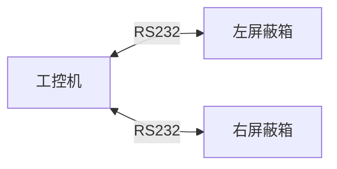
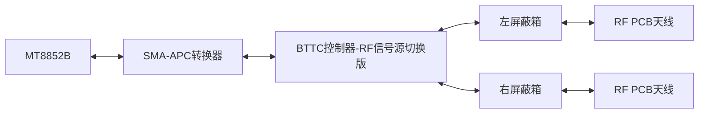
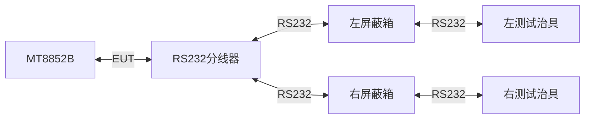
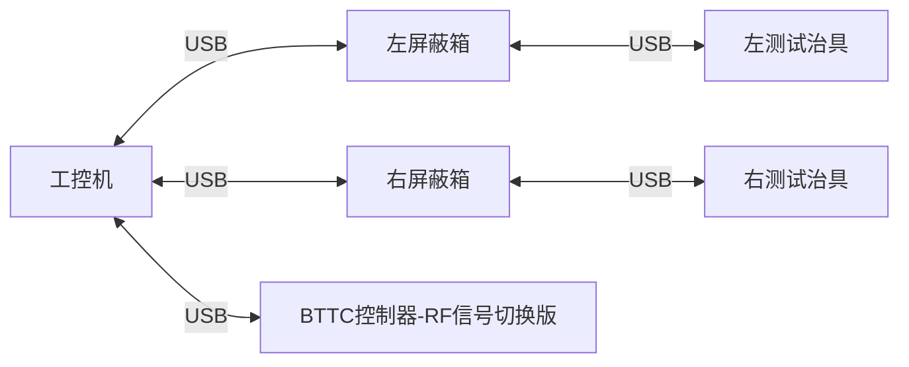
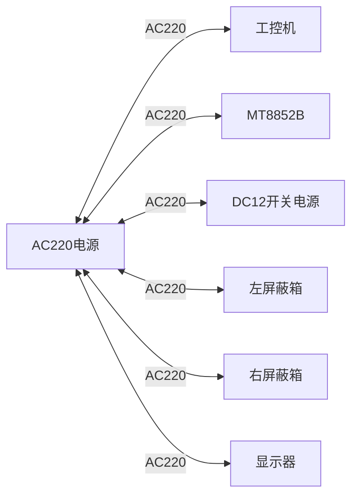
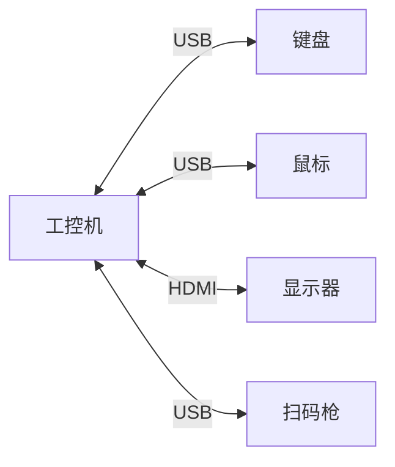
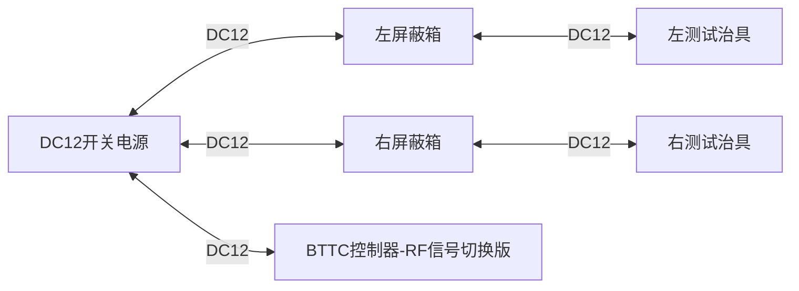

# BTTP RF测试平台硬件架构说明书

文件版本：V1.0 日期：2023-04-27 作者：研发中心 梁健明

## 0 目录
---

- [BTTP RF测试平台硬件架构说明书](#bttp-rf测试平台硬件架构说明书)
  - [0 目录](#0-目录)
  - [1 测试平台硬件架构简介](#1-测试平台硬件架构简介)
  - [2 测试平台物料清单](#2-测试平台物料清单)
  - [3 测试平台线路连接图](#3-测试平台线路连接图)
    - [3.1 屏蔽箱控制信号线连接](#31-屏蔽箱控制信号线连接)
    - [3.2 RF射频信号线连接](#32-rf射频信号线连接)
    - [3.3 EUT数据线连接](#33-eut数据线连接)
    - [3.4 BTTC控制器连接](#34-bttc控制器连接)
    - [3.5 MT8852B控制连接](#35-mt8852b控制连接)
    - [3.6 AC220电源连接](#36-ac220电源连接)
    - [3.7 工控机交互设备连接](#37-工控机交互设备连接)
    - [3.8 DC12开关电源连接](#38-dc12开关电源连接)

## 1 测试平台硬件架构简介
---
 

测试平台硬件架构的核心是MT8852B，其他工控机、BTTC等设备均围绕MT8852B进行射频信号切换和EUT信号切换等工作。所以，测试平台的硬件搭建主要分电源线路连接、射频信号连接、控制信号连接三部分组成。

在第2章中介绍了测试平台的物料清单，物料清单上标注的数量均为最小使用量。建议适当增加备料。

第3章中介绍了测试平台的线路连接图。如有描述不清晰的地方，可联系研发中心进行咨询或请求协助。

 

 

## 2 测试平台物料清单
---
 

 

---
| 物料名称 | 物料型号 | 数量 | 备注 |
| :--- | :--- | :--- | :--- |
| 工控机 |  | 1台 | 1. RS232接口6个及以上 2. USB接口7个及以上 3. 预装Windows 10 系统 |
| 测试治具 |  | 2台 |  |
| 信号屏蔽箱 |  | 2台 | 1. 气动控制  2. 内部空间体积需和使用方确认   3. 需带通信控制接口  4. 接口板需带USB至少1个，RS232至少1个，DC插座至少1个 5. 接口板需带RF输入接口1个|
| RS232 母对母连接线 | 1.5米 | 4根 |  |
| RS232 公转母连接线 | 1米 | 3根 |  |
| Anritsu MT8852B 蓝牙测试仪 |  | 1台 | 需支持BLE Data Length Extension扩展协议测试 |
| SMA-APC转换器 || 1个 | 默认MT8852B原厂附带 |
| SMA射频连接线| 1米 | 3根 |  |
| SMA转N母头射频连接线| 1.5米 |2根 |  |
| EUT/RS232/HCI测试线 | 2000-1546-R | 1根 | 默认MT8852B原厂附带 |
| RS232串口分配器| 1进2出| 1个 | 进口为母口，出口为工口 |
| USB Type-A (公对公) | 1.5米 | 5根 |  |
| USB Type-A (公对公) | 0.3米 | 2根 |  |
| BTTC控制器 || 3个 | 研发中心设计和制作 |
| RF射频开关(双通道) | SPQM-SW-2ST4T | 1个 | 1. 典型插损需小于2dB 2. 端口隔离大于等于45dB 3. 工作频率覆盖覆盖2.4GHz频段 4. 需具备金属屏蔽外壳 |
| GPIB转USB板卡 | NI GPIB-USB-HS | 1个 |  |
| AC220三插电源线 |  | 6根 | 一根2米，其余1.5米 |
| 鼠标 |  | 1个 |  |
| 键盘 |  | 1个 |  |
| 显示器 |  | 1个 |  |
| 扫码枪 |  | 1个 |  |
| 4芯屏蔽线 | 10米 | 1根 | 0.5平方 无氧铜芯 |
| RF PCB天线 | 2.4GHz | 2个 | SMA接口，0.3米 |

 

> 注：以上物料清单中的物料均为最小使用量，建议适当增加备料。
 

 
 

## 3 测试平台线路连接图
---
 

### 3.1 屏蔽箱控制信号线连接
 

这部分线路描述为工控机与屏蔽箱之间的连接线路，不包含屏蔽箱内部的连接线路，屏蔽箱内部的连接线路在其他章节中描述。线材一端连接工控机的RS232接口，接口位置没有限制，另外一端连接屏蔽箱下端的的通讯接口，用于接收屏蔽箱的状态信号和发送开关箱指令。 使用连接线为RS232 母对母连接线。\

 

 

>  注意：这里用的RS232 母对母为专用线，不能和其他线类混用，需对线芯的TX和RX进行交叉连接，否则会导致通信失败。

>  注意：平台搭建完成后，该屏蔽箱RS232控制线在工控机端的接口位置不可更改，否则会导致通信失败。需联系研发中心工程师进行更改和调试。
 

 
 

### 3.2 RF射频信号线连接
 

该部分描述系统中射频线的连接关系，包括MT8852B与BTTC控制器的连接，BTTC控制器与屏蔽箱的连接，屏蔽箱与RF PCB天线的连接。 \
使用线材均为SMA射频连接线。

 

 
 

### 3.3 EUT数据线连接
 

该部分描述为MT8852B测试控制接口EUT到待测样品的连接线路，该线路使用
EUT/RS232/HCI测试线连接至RS232分线器，输出端连接左右屏蔽箱外部接线板的RS232接口，屏蔽箱内部接线板的RS232接口连接左右测试治具。 \
RS232分线器连接至屏蔽箱的RS232接口，使用为RS232 公转母连接线。

 

 

> 注意：a. 切勿混淆屏蔽箱的通讯RS232端口和接线板RS232接口；
b. 屏蔽箱内部接线板的RS232到测试治具间的连接线为RS232转4Pin 2.54mm连接线；该线需联系研发中心确定接线顺序或协助定制。

 
 

### 3.4 BTTC控制器连接
 

该部分介绍工控机对三个BTTC控制器的连接关系，其中使用线材均为USB Type-A (公对公)连接线。对连载的工控机USB接口没有限制。

 

> 注意：在屏蔽线内部接线板与治具内部的BTTC控制器的连接线为0.3m的USB Type-A (公对公)连接线。

 
 

### 3.5 MT8852B控制连接
 

该部分介绍工控机与MT8852B的连接关系.NI GPIB-USB-HS连接至工控机的USB接口，对接口位置没有限制。

 

 

>  注意：切勿在同一台工控机上连接多个NI GPIB-USB-HS，否则会导致BTTP测试程序对MT8852B的通信失败问题。

 
 

### 3.6 AC220电源连接
 

下面列举了AC220电源的用电设备和连接图。

 

 
 

### 3.7 工控机交互设备连接
 

下面列举了工控机交互设备的用电设备和连接图。

 

 
 

### 3.8 DC12开关电源连接
 

该部分介绍了测试系统中DC12用电设备和连接图。DC12电源通过DC5.5*2.1mm连接至屏蔽箱外部连接板的DC接口上。在屏蔽箱内部，DC12电源线同样通过DC5.5*2.1mm连接至屏蔽箱内部连接板的DC接口上，另外一端连接至治具中BTTC上。关于BTTC上DC12的连接方式可咨询研发中心工程师或请求协助。

 

 
 

    

